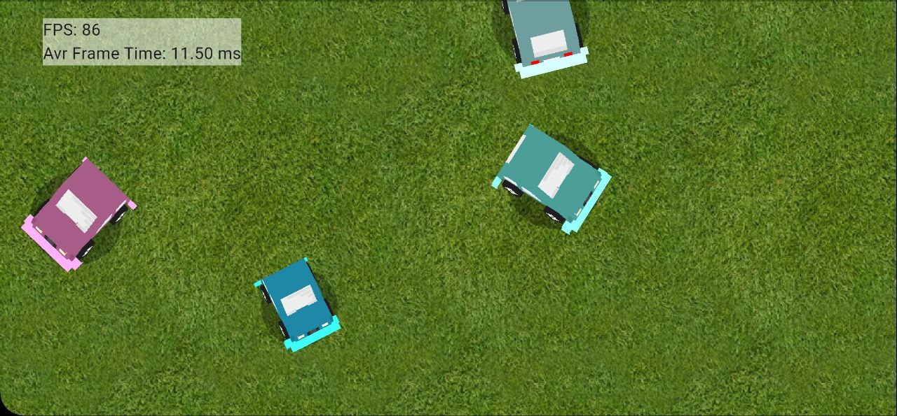

# Sprite Stacking with GLSL in Flutter

This repository demonstrates the use of GLSL shaders to render pseudo-3D objects using the **Sprite Stacking** technique within a **Flutter** application. Sprite stacking involves layering 2D textures with slight offsets to create the illusion of 3D objects, achieving a unique and retro-inspired visual style.

## Features

- 📦 **Sprite Stacking Rendering**: A simple yet effective approach for rendering pseudo-3D objects.
- 🚀 **High Performance**: Achieves a stable 80-90 FPS on most modern devices.
- 🌐 **GLSL Shaders**: Implements efficient custom GLSL shaders for rendering.
- 🎮 **Interactive Demo**: Experience real-time sprite stacking in action.

## Screenshot

## How It Works

1. **Flutter for UI**: The app is built using Flutter, taking advantage of its cross-platform capabilities.
2. **Custom GLSL Shaders**: The core rendering logic leverages GLSL shaders to stack sprites and create the pseudo-3D effect.
3. **Optimized Performance**: Fine-tuned rendering pipeline to maximize FPS without sacrificing visual quality.

## Challenge: Improve the Performance 🚀
Currently, the app achieves a solid 80-90 FPS, but there's always room for improvement! Here's how you can contribute:

1. Optimize GLSL Shaders: Experiment with the shader code to make it more efficient while maintaining visual fidelity.
2. Reduce Overhead: Identify and minimize bottlenecks in the rendering pipeline or Flutter integration.
3. Enhance Features: Add advanced effects like lighting, shadows, or animation to push the boundaries of what's possible with sprite stacking.

## License
This project is licensed under the MIT License. See the LICENSE file for details.

## Let's Push Sprite Stacking to the Next Level! 🚀
If you have ideas, questions, or feedback, feel free to open an issue or start a discussion. Together, we can explore the full potential of this fascinating technique!